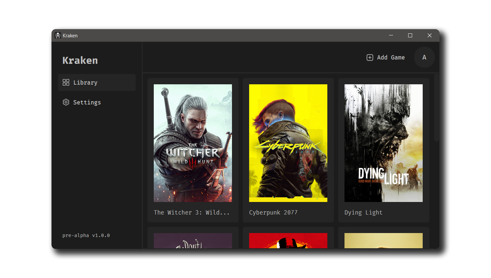

  

<h1 align="center">Kraken Cloud Service</h1>

  

## About
**Kraken** is a **Cloud Service** designed to store and manage unlicensed (cracked) game saves. The project provides a convenient way to synchronize game data between different devices.

## Requirements
* Support for storing game saves for multiple users
* Ability to upload and download save files
* Data security (encryption and authentication)
